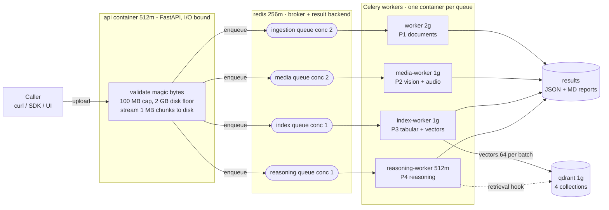
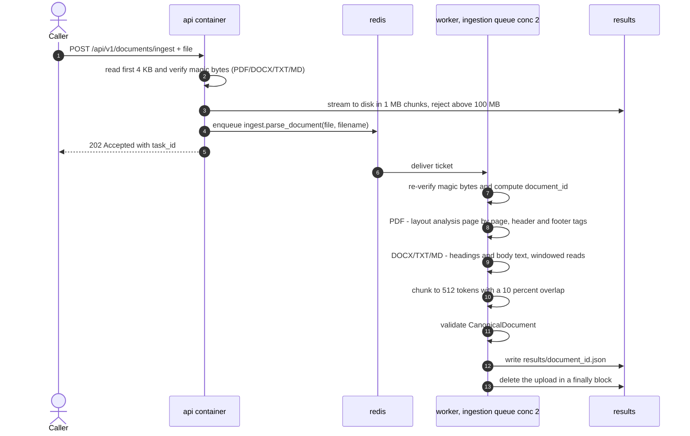
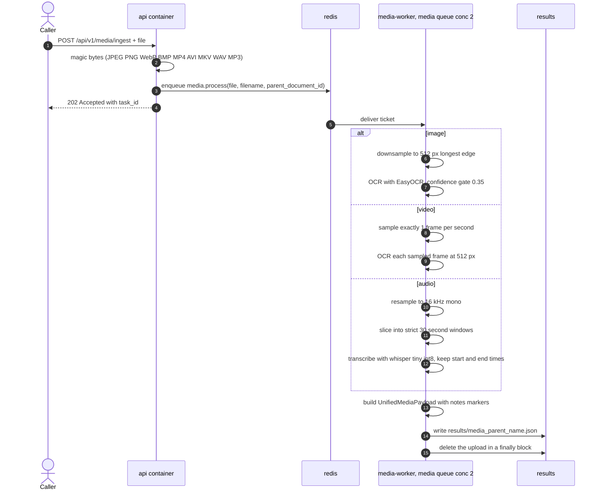
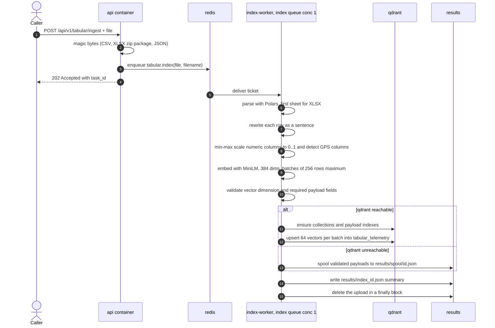
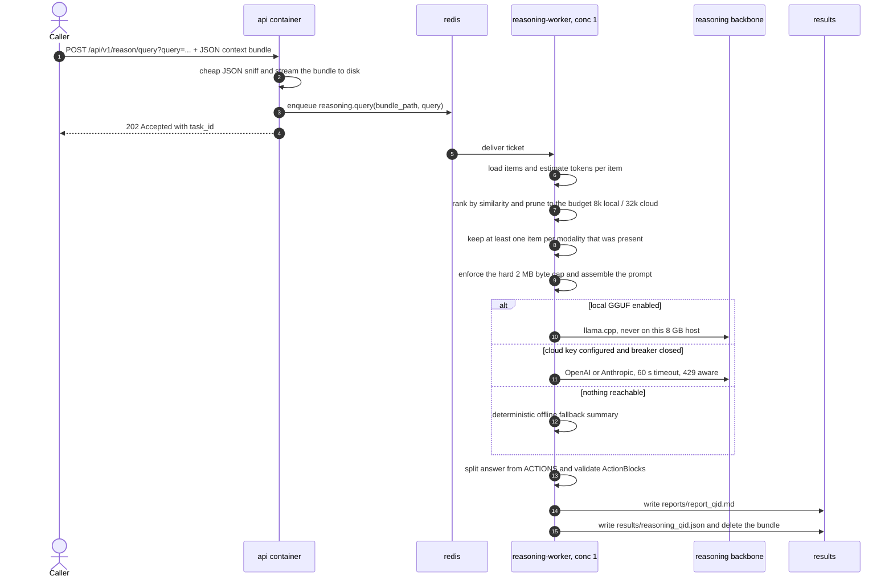
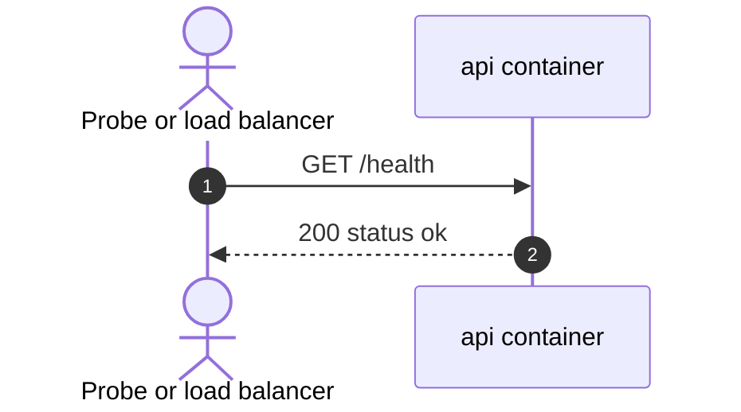
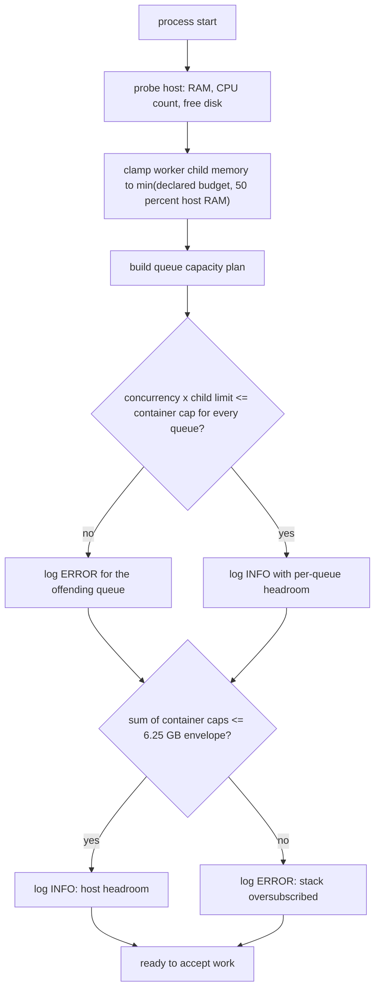

# HLD — High-Level Design & Execution Flows

High-level design of the Multimodal AI Ingestion Engine: the components, and the
**step-by-step flow of every execution the system can perform**.

Diagrams are [Mermaid](https://mermaid.js.org/) and render automatically on GitHub.
A plain-text version of the top-level view is included for terminals and printers.

> Plain-English companion: [`EXPLAINER.md`](EXPLAINER.md) · architecture map:
> [`INDEX.md`](INDEX.md)

---

## 1. System at a glance



Same view as plain text, for terminals:

```
  Caller
    POST /api/v1/{documents|media|tabular}/ingest      POST /api/v1/reason/query
    │
    ▼
  ┌─ api container 512m  -  FastAPI, I/O bound ─────────────────────────────────────────────────┐
  │ verify magic bytes (real signature, never the filename)  |  100 MB cap  |  2 GB disk floor  │
  │ stream to disk in 1 MB chunks, then answer 202 Accepted + task_id                           │
  │                                                                                             │
  └──────────────────────────────────────────┬──────────────────────────────────────────────────┘
                                             │ enqueue Celery ticket
                                             ▼
  ┌─ redis 256m  -  broker + result backend ────────────────────────────────────────────────────┐
  │ ingestion conc 2        media conc 2        index conc 1        reasoning conc 1            │
  │                                                                                             │
  └─────────┬───────────────────────┬───────────────────────┬───────────────────────┬───────────┘
            ▼                       ▼                       ▼                       ▼
  ┌─ 1  worker ────────┐  ┌─ 2  media ─────────┐  ┌─ 3  index ─────────┐  ┌─ 4  reason ────────┐
  │ 2g                 │  │ 1g                 │  │ 1g                 │  │ 512m               │
  │ P1 documents       │  │ P2 vision          │  │ P3 tabular         │  │ P4 reasoning       │
  │                    │  │ P2 audio           │  │                    │  │                    │
  └────────────────────┘  └────────────────────┘  └────────────────────┘  └────────────────────┘
            └───────────────────────┴───────────┬───────────┴───────────────────────┘
                                                │
                                                ▼
  ┌─ results/  *.json  +  reports/*.md ─────────────────────────────────────────────────────────┐
  └─────────────────────────────────────────────────────────────────────────────────────────────┘
```

Legend: **qdrant 1g** holds the 384-dim vectors — index-worker writes them (64 per batch)
and reasoning-worker reads retrieval context back. Phases 1-4 run in separate containers so
one heavy video can never block a small text file.


---

## 2. Every execution the system can perform

| # | Execution | Trigger | Ticket (queue) | Executor | Result |
|---|---|---|---|---|---|
| 1 | Document ingestion | `POST /api/v1/documents/ingest` | `ingestion` | worker 2g, conc 2 | `results/<document_id>.json` |
| 2 | Media processing | `POST /api/v1/media/ingest` | `media` | media-worker 1g, conc 2 | `results/media_<id>_<name>.json` |
| 3 | Tabular indexing | `POST /api/v1/tabular/ingest` | `index` | index-worker 1g, conc 1 | `results/index_<id>.json` (+ Qdrant) |
| 4 | Reasoning query | `POST /api/v1/reason/query` | `reasoning` | reasoning-worker 512m, conc 1 | `results/reasoning_<qid>.json` + `reports/report_<qid>.md` |
| 5 | Health check | `GET /health` | — (inline) | api container | `{"status": "ok"}` |

**Universal pattern for 1–4:** the API validates and stores the file, puts a ticket on a
queue, and answers `202 Accepted` immediately. A worker picks the ticket up and does the
slow work. Nothing slow ever happens inside the HTTP request.

---

## 3. Execution 1 — upload a document



**Produces:** `document_id`, `metadata`, `payloads[]` (chunk_id, page_number, modality,
content, structural_tag) and `extracted_media_references[]`.

**Failure paths:** unsupported bytes → `415` at the API · too large → `413` with the
partial file deleted · unreadable PDF → task fails with `ParsingFailure`, and the upload
is still cleaned up.

---

## 4. Execution 2 — upload media (image, video, audio)



**Produces:** one payload per image/frame/window: `processed_text_content`,
`media_metadata` (resolution, sample rate, duration, temporal anchors) and `notes[]` such
as `ocr_unavailable`, `asr_unavailable`, `image_decode_failed`.

**Failure paths:** a missing OCR/ASR model yields empty text plus a note, never a crash ·
`ffmpeg` missing means MP3 reports a clear message while WAV still works · per-item work
runs under a 300 s timeout, and `ffmpeg` itself under 120 s.

---

## 5. Execution 3 — upload tabular data (CSV, XLSX, JSON)



**Produces:** a summary (rows indexed, table shape, per-column scaling ranges, `is_gps`,
store mode `qdrant` or `spooled`, embedding backend) plus searchable vectors.

**Failure paths:** Qdrant down → 5 retries with exponential backoff → validated offline
spool, so no data is lost · `sentence-transformers` absent → deterministic hash fallback
and the pipeline still completes · unknown collection or wrong dimension →
`SchemaValidationError` before any write reaches the database.

---

## 6. Execution 4 — ask a question



**Produces:** `query_id`, `backend_used`, `answer_text`, validated `actions[]`,
`report_path`, `pruning` statistics and `context_bytes`.

**Failure paths:** provider 5xx or timeout → 3 failures open the circuit breaker for 30 s ·
rate limit `429` honoured with `Retry-After` · oversized context → `ContextOverflowError`
instead of shipping gigabytes · malformed action lines become `action: "unparsed"` rather
than failing the whole report.

---

## 7. Execution 5 — health check



Handled inline — no queue, no worker, no disk access.

---

## 8. What every execution shares

All four async executions are the same shape, so the behaviour is predictable:

| Stage | What happens | Where |
|---|---|---|
| 1. Validate | Real byte signature checked (never the filename or the client's content type) | `app/magic.py`, `app/media/pipeline.py`, `app/tabular/parsers.py` |
| 2. Persist | Streamed to disk in 1 MB chunks, 100 MB ceiling, HTTP 507 below 2 GB free | `app/storage.py` |
| 3. Enqueue | One Celery task onto that phase's dedicated queue | `app/main.py` → `app/tasks*.py` |
| 4. Ack | `202 Accepted` with a `task_id` — never blocks on the work | `app/main.py` |
| 5. Process | Worker does the slow work, lazily loading models | `app/tasks*.py` → phase module |
| 6. Persist result | Validated JSON written to `results/` | `app/storage.py::save_result` |
| 7. Clean up | Upload deleted in a `finally` block, even on failure | `app/tasks*.py` |
| 8. Report | Structured JSON log line per stage (no print statements) | `app/logging_config.py` |

---

## 9. Startup execution (runs once, before any work)



Verified by `tests/test_capacity.py`, which also fails the build if `docker-compose.yml`
ever drifts from `app/config.py`.

---

## 10. Where each execution lives in code

| Execution | HTTP entry | Task | Core logic | Contract |
|---|---|---|---|---|
| 1. Documents | `app/main.py::ingest_document` | `app/tasks.py::parse_document_task` | `app/parser/` (pdf, docx, chunker) | `app/schemas.py` |
| 2. Media | `app/main.py::ingest_media` | `app/tasks_media.py::process_media_task` | `app/media/` (vision, video, audio) | `app/schemas_media.py` |
| 3. Tabular | `app/main.py::ingest_tabular` | `app/tasks_tabular.py::index_tabular_task` | `app/tabular/` + `app/embeddings.py` + `app/vector_store.py` | `app/vector_schema.py` |
| 4. Reasoning | `app/main.py::reason_query` | `app/tasks_reasoning.py::reasoning_task` | `app/reasoning/` (context, prompt, backends, compiler) | `app/reasoning/output_compiler.py` |
| 5. Health | `app/main.py::health` | — | — | — |

Shared infrastructure: `app/config.py` (settings) · `app/resources.py` (capacity) ·
`app/celery_app.py` (queues) · `app/storage.py` (files) · `app/logging_config.py`
(JSON logs) · `app/media/device_manager.py` (CPU/MPS/CUDA policy).
